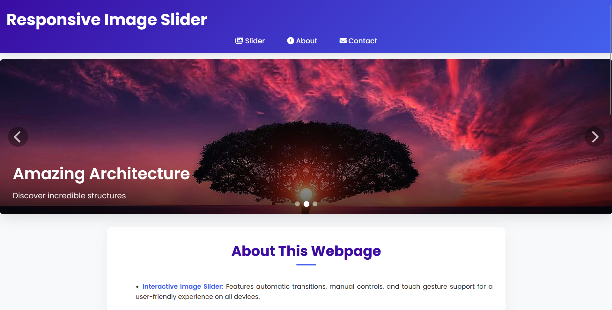

<div align="center">

# 🖼️ Responsive Image Slider

### A modern, fully responsive image slider with autoplay, navigation, and touch support
---

## [View Demo](https://sainath-666.github.io/Responsive_Image_Slider/)



</div>

## ✨ Features

- **Smooth Transitions** - Beautiful slide animations with content fade-in effects
- **Fully Responsive** - Looks great on all devices (mobile, tablet, desktop)
- **Touch Enabled** - Swipe to navigate on touch devices
- **Accessibility** - Keyboard navigation and screen reader support
- **Pause on Hover** - Autoplay pauses when user interacts with slider
- **Dot Navigation** - Click indicators to jump to specific slides
- **Modern Design** - Clean, contemporary UI with smooth animations

## 🛠️ Built With

- HTML5
- CSS3 (with CSS variables and Flexbox)
- Vanilla JavaScript (ES6+)
- Font Awesome icons

## 📱 Responsive Design

The slider and entire page are fully responsive with specific optimizations for:

- **Mobile phones** (< 480px)
- **Tablets** (< 768px)
- **Desktops and larger screens** (> 768px)

## 🔍 How It Works

The slider uses vanilla JavaScript to handle:

1. **Automatic rotation** of slides every 5 seconds
2. **Manual navigation** through next/previous buttons
3. **Touch gestures** for swiping on mobile devices
4. **Dot indicators** for direct slide selection
5. **Pause on hover** to improve user experience

## 📋 Usage

To use this slider in your project:

1. Clone the repository
2. Replace the images in the `img` folder with your own
3. Adjust the slide content in the HTML file
4. Customize colors in the CSS variables section

```css
:root {
    --primary-color: #4361ee;
    --secondary-color: #3a0ca3;
    /* Add your custom colors here */
}
```

## 🤝 Connect with Me

[](https://www.linkedin.com/in/sainath666)
[](https://github.com/sainath-666)


---
<div align="center">
  <p>Made with ❤️ by Your Sainathreddy</p>
</div>
